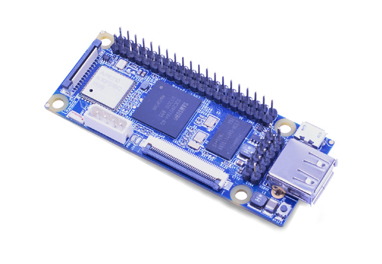

# NanoPi

## 简介   
NanoPi是友善之臂专门为嵌入式Linux爱好者、创客、玩家设计的一款低功耗ARM主控板，它的尺寸只有Raspberry Pi(RPi)的一半大小，并且兼容RPi的GPIO接口，NanoPi集成无线WiFi和蓝牙4.0模块，并带有并行摄像头接口，和全彩LCD接口，可从TF卡运行Linux/Debian系统，非常适合物联网、无线智能小车、机器人、图像识别、人机界面等应用开发。

## 资源特性

    CPU: Samsung S3C2451, 运行主频400Mhz
    RAM: 64M DDR2
    集成SDIO WiFi蓝牙模块
    USB Type A x1
    调试串口 x1
    microSD Slot x1
    microUSB x1: 支持供电和数据传输，可模拟为串口和以太网
    LCD接口: 0.5mm间距贴片FPC座，支持全彩LCD (RGB:8-8-8)
    DVP Camera接口：0.5mm间距竖直贴片FPC座，包含ITU-R BT 601/656 8-bit，I2C和IO
    GPIO1: 2.54mm间距，40pin, 兼容RPi的GPIO，含UART, SPI, I2C, IO等管脚资源
    GPIO2: 2.54mm间距, 12pin, 含I2S, I2C, UART等管脚资源
    PCB 尺寸: 75 x 30 mm
    供电: DC 5V
    软件支持: u-boot, Linux-4.1, Debian8 jessie, Rabbit linux
