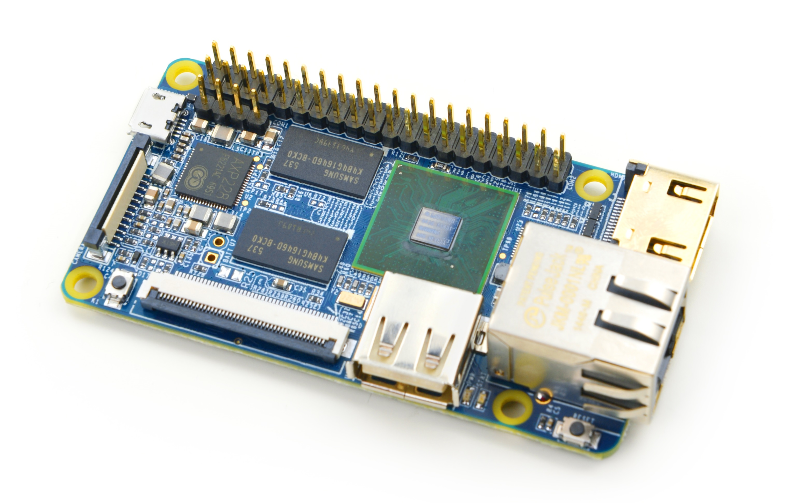

# NanoPi Fire

## 简介
NanoPi 2Fire(烈火版)是友善之臂团队推出的又一款完全开源创客神器，支持运行Debian, Android 5.1等系统，它依然保持和NanoPi 2一样大小的身材(75x40mm，仅有信用卡的三分之二大小)，移除了WiFi蓝牙模块，代以提供了千兆以太网接口，并采用了AXP228电源管理单元，可支持软件开关机，睡眠唤醒等功能。    
NanoPi 2 Fire及系列或许是迄今最小的四核A9”树莓派”类板卡(没有之一), 尽管非常紧凑，却依然保持了相当丰富的接口，除了标准的HDMI, USB和千兆以太网口，还包兼容树莓派的IO口，可支持I2C电容屏的LCD接口，并行CMOS摄像头接口，和1路专用调试串口等。    
依托Debian/Android的强大生态系统，以及各式各样的扩展配件，NanoPi 2 Fire可以帮助用户轻松实现从创意到原型再到批量生产的交付，是怀有大想法的创客、梦想家、艺术家、业余爱好者和小规模创业团队的理想纵横平台。

## 资源特性

    CPU: S5P4418, 运行主频1.4GHz
    RAM: 1GB DDR3
    网络: 千兆以太网口 x1
    USB 2.0 Type A x1
    调试串口 x1
    microSD Slot x1
    microUSB x1: 支持供电和数据传输
    LCD接口: 0.5mm间距贴片FPC座，支持全彩LCD (RGB:8-8-8)
    HDMI: 符合1.4a规范, Type-A连接器, 1080P60输出
    DVP Camera接口：0.5mm间距竖直贴片FPC座，包含ITU-R BT 601/656 8-bit，I2C和IO
    GPIO1: 2.54mm间距，40pin, 兼容RPi的GPIO，含UART, SPI, I2C, PWM, IO等管脚资源
    按键: 电源按键一个, 复位按键一个
    LED: 电源LED一个, 系统指示LED一个
    PCB 尺寸: 75 x 40mm
    供电: DC 5V/2A
    温度工作范围：零下20摄氏度到80摄氏度
    软件支持: 安卓, Debian, UbuntuCore+Qt
