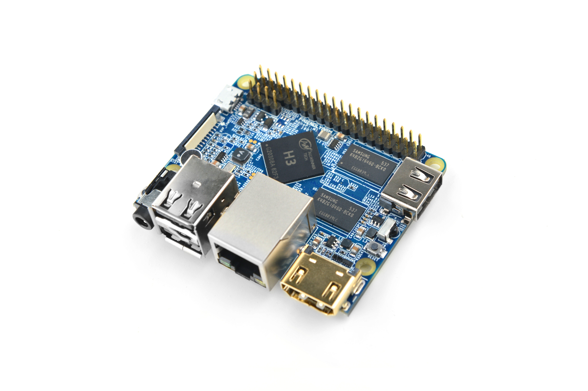

# NanoPi M1

## 简介
- NanoPi M1（以下简称M1）是友善之臂团队面向创客、嵌入式爱好者，电子艺术家、发烧友等群体推出的又一款完全开源的掌上创客神器，它的大小只有树莓派的大约2/3，可运行Debian、Ubuntu-MATE、Ubuntu-Core、Android等操作系统。
- NanoPi M1采用了全志高性能处理器Allwinner H3，集成以太网、红外接收、视频/音频输出等接口，支持HDMI、AVOUT视频输出等功能。
- 尽管体积很小，设计却紧凑美观。NanoPi M1引出了相当丰富的接口，包括HDMI、以太网、USB-Host、USB-OTG、DVP camera和AVOUT（音频+视频）等。而且集成了板载麦克风，红外接收器，并且兼容树莓派GPIO口，并且拥有独立的调试串口等。

## 资源特性

    CPU：Allwinner H3, Quad-core Cortex-A7@1.2GHz
    GPU：Mali400MP2@600MHz，Supports OpenGL ES2.0
    DDR3 RAM：512MB/1GB
    网络：10/100M以太网
    音频：3.5mm耳机座/Via HDMI
    麦克风：板载麦克风
    红外：板载红外接收模块
    USB Host：Type A型号，USB 2.0 x 3
    MicroSD Slot：x1
    MicroUSB ：支持供电和数据传输，有OTG功能
    视频输出: HDMI 1.4 1080P高清显示, CVBS
    DVP Camera接口：24pin，0.5mm间距竖直贴片FPC座
    调试串口：4Pin，2.54mm排针
    GPIO： 40pin, 2.54mm间距，兼容RasberryPi2的扩展GPIO，含UART, SPI, I2C, PWM, IO等管脚资源
    按键：电源按键x1，复位按键x1
    PC Size: 64 x 56mm
    Power Supply: DC 5V/2A
    温度工作范围：零下30摄氏度到70摄氏度
    OS/Software: U-boot，Debian，Ubuntu-MATE，Ubuntu-Core
