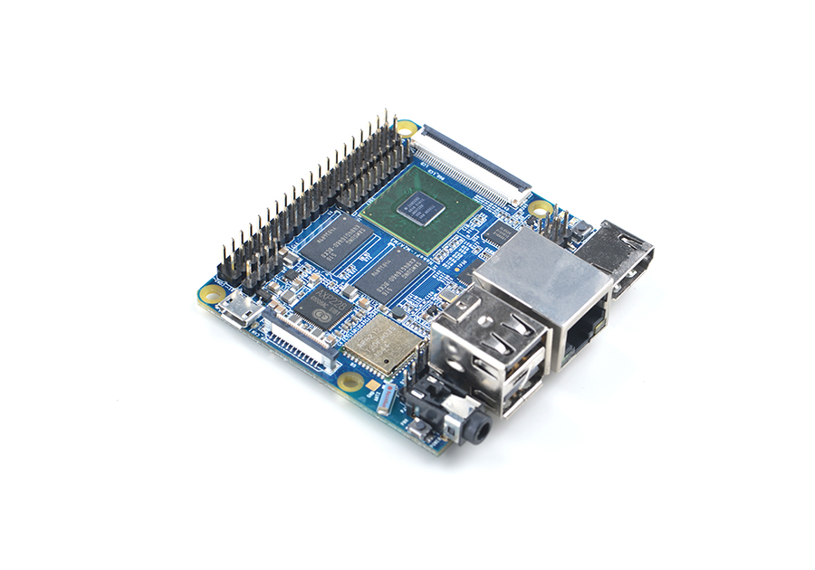

# NanoPi M3

## 简介
- NanoPi M3（以下简称M3）是友善之臂团队面向创客、极客、嵌入式爱好者、电子艺术家、发烧友等群体推出的又一款强劲的完全开源的掌上创客神器。
- NanoPi M3采用三星八核A53高性能处理器S5P6818，动态运行主频400M-1.4GHz，集成千兆以太网卡，WiFi、蓝牙，并采用了AXP228电源管理芯片。可支持软件开关机，并采用MicroUSB供电，板载陶瓷天线。
- 体积足够小，接口却丰富，NanoPi M3引出了视频输入/输出接口（DVP Camera/LVDS/HDMI/LCD接口），千兆以太网口，I2S接口，3.5mm音频输出接口，更是留出了四个USB接口，带串口调试功能。

## 资源特性

    CPU: S5P6818, 动态运行主频400Mhz--1.4GHz
    PMU 电源管理：AXP228，支持软件关机和睡眠唤醒等
    DDR3 RAM: 1GB
    SD: microSD卡槽一个
    网口: 千兆以太网接口(RTL8211E)
    Wireless：802.11 b/g/n
    Bluetooth：4.0 dual mode
    天线: Wi-Fi和蓝牙共用, 板载陶瓷天线
    音频：3.5mm耳机座/Via HDMI
    I2S：板载I2S接口,7Pin,2.54mm排针
    麦克风: 通过3.5mm耳机孔输入
    USB Host: 4 x USB 2.0 Host , 其中两个是标准A型接口, 另外两个是2.54mm排针
    Micro USB: 1 x USB 2.0 Client
    LCD接口: 45pin, 0.5mm间距FPC贴片座，支持全彩TFT LCD (RGB:8-8-8)
    HDMI: HDMI 1.4a, Type A型口，1080P高清显示
    LVDS接口：20Pin,2.0mm排针
    DVP Camera接口: 24pin, 0.5mm间距，FPC贴片竖座
    GPIO扩展接口: 40 Pin,2.54mm排针,兼容NanoPi M1,M2,树莓派等创客板
    调试串口：4Pin，2.5mm单排针
    按键：K1（电源按键），Reset
    LED：电源指示灯,系统状态指示灯
    RTC: 支持RTC, 带纽扣电池引线孔
    PCB Size:64x60mm，8层，沉金工艺
    供电: DC 5V/2A
    温度工作范围：零下30摄氏度到70摄氏度
    OS/Software: u-boot, Android5.1, Debian8
