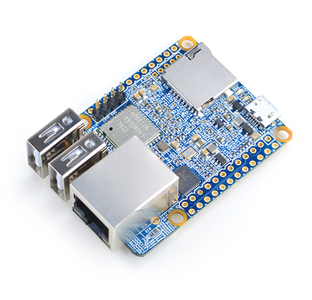

# NanoPi NEO2 Plus

## 简介
- NanoPi NEO Plus2是友善电子团队推出的又一款小巧ARM计算机，它采用全志64位四核A53处理器H5，内置六核Mali450 GPU，集成1GB DDR3内存,标配 8GB eMMC高速闪存。
- NanoPi NEO Plus2依然小巧精致，尽管尺寸仅有40x52mm，却板载了AP6212A WiFi蓝牙模块，以及千兆以太网接口，板子引出了双路标准USB接口，支持从MicroSD卡启动运行系统。
- NanoPi NEO Plus2采用了专业的电源系统设计，采用6层板布线，具有良好的散热特性。适合对体积要求高，数据传输量大，数据传输速度快，和更高计算性能的物联网应用。

## 资源特性

    CPU：Allwinner H5，Quad-core 64-bit high-performance Cortex A53
    DDR3 RAM :1GB
    Storage：8GB eMMC
    Network：10/100/1000M以太网口，采用RTL8211E-VB-CG传输芯片
    WiFi：802.11b/g/n
    Bluetooth：4.0 dual mode
    MicroSD Slot：1个，支持启动和储存系统
    音频输入和输出: 5Pin, 2.0mm间距单排针
    MicroUSB：供电功能
    Debug Serial：4Pin，2.54mm间距单排针
    GPIO1：24Pin，2.51mm间距双排针，含UART、SPI、I2C、IO 等管脚资源
    GPIO2：12Pin，2.54mm间距单排针，含USB、红外接收、I2S、IO等管脚资源
    PCB Size：40 x 52mm
    PCB Layer：6层
    Power Supply：DC 5V/2A
