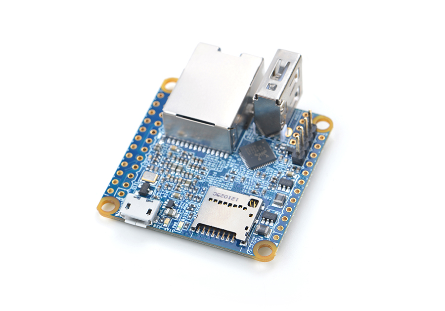

# Nano NEO 2

## 简介
- NanoPI NEO2是友善之臂团队推出的全新一代超小型ARM计算机，它采用全志64位四核A53处理器H5, 内置六核Mail450 GPU, 集成512M DDR3内存，可支持运行Ubuntu Core，Armbian等嵌入式操作系统。NEO2依然小巧精致，尺寸如一，并且和第一代NEO接口兼容。
- 更为惊人的是，在极其有限的空间里，NEO2采用了千兆以太网接口，并带有1个标准USB接口，因此非常适合对体积要求高，数据传输量大，数据传输速度快，和更高计算性能的物联网应用；它也是创客、高端极客们发挥创意的绝佳选择。

## 资源特性

    CPU: Allwinner H5, Quad-core 64-bit high-performance Cortex A53
    DDR3 RAM: 512MB
    网络：10/100/1000M 以太网口, 采用RTL8211E-VB-CG网络传输芯片
    USB Host: 3路，其中1路为标准A型口，另外2路位于GPIO2
    MicroSD Slot:1个, 支持启动和存储系统
    指示灯: 2个, 分别用于电源, 和系统状态(蓝色)
    GPIO1: 24pin, 2.54mm间距双排针,兼容树莓派GPIO之管脚1-24， 含UART, SPI, I2C, IO等管脚资源
    GPIO2: 12pin, 2.54mm间距双排针, 含USB, 红外接收, I2S, IO等管脚资源
    调试串口: 4Pin, 2.54mm间距单排针
    音频输入和输出: 5Pin, 2.0mm间距单排针
    PCB Size: 40 x 40mm
    MicroUSB: 供电(5V/2A)，并具备OTG功能
    OS/Software: u-boot,Ubuntu Core
    Weight: 13g(WITHOUT Pin-headers)
