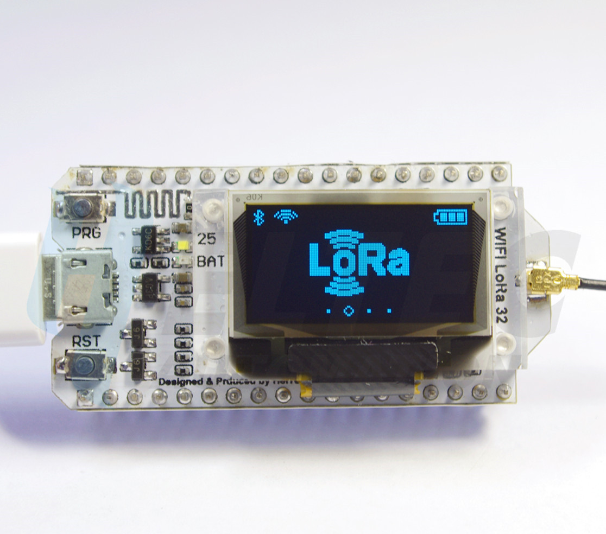
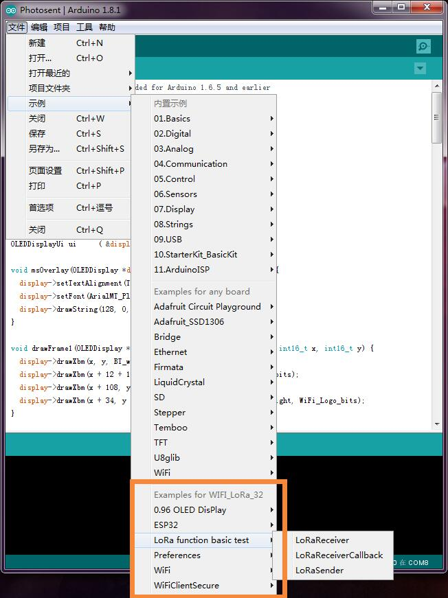
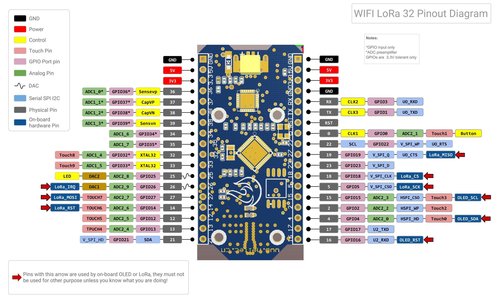

# WiFi_LoRa_32

## 简介
- WIFI Kit系列是 惠特自动化新开发的高性价比物联网开方案，主控芯片采用乐鑫ESP32，Tensilica LX6双核处理器，主频240MHz，运算能力高达600DMIPS，芯片内置520 KB SRAM、802.11 b/g/n HT40 Wi-Fi收发器、基带、协议栈和LWIP、集成双模蓝牙（传统蓝牙和BLE低功耗蓝牙）。

- 本品是在WIFI Kit 32的基础上增加了SX1278芯片，即LoRa™远程调制解调器，433MHz频率，约-148dBm的高灵敏度，+20dBm的功率输出，可靠性高，传输距离远（实测空旷地带通信距离2.6Km）。

- 板载32MByte Flash、Wi-Fi天线、0.96寸蓝色OLED显示屏、锂电池充电电路和接口、CP2102 USB转串口芯片，完美支持Arduino开发环境，可以非常简单快速的用于方案验证和产品开发。
    

## 管脚定义

