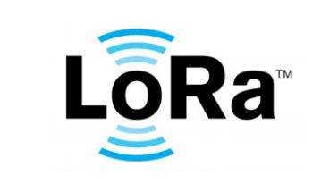

# LoRaWAN学习笔记
    

## 概念
- 通讯模式有三种模式，称为class A,B,C
    - Class A：在节点上发报文后开启一段时间的接收窗口，功耗最低
    - Class B：节点和网关商定好时间周期开启接收窗口，功耗较低
    - Class C：节点接收功能持续开启，功耗较高。

未完待续。。。。

---

欢迎关注我的微信公众号：**墨意MOE**    

