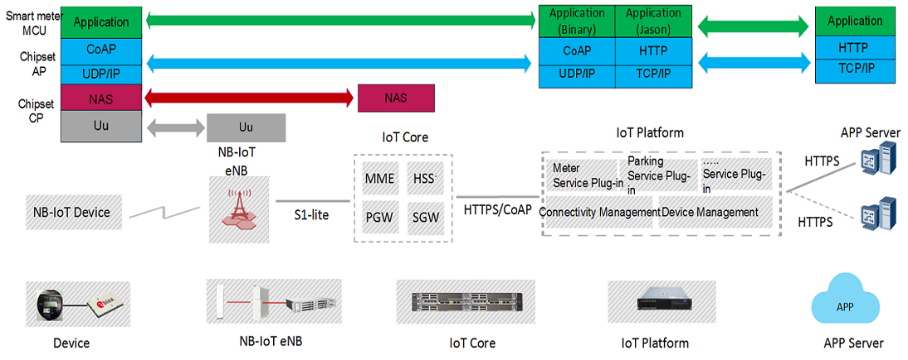
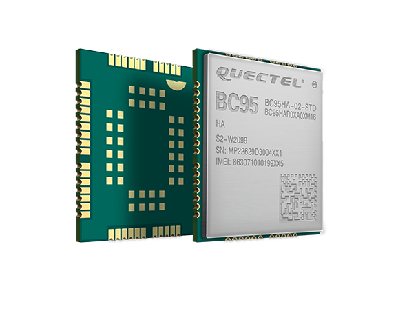
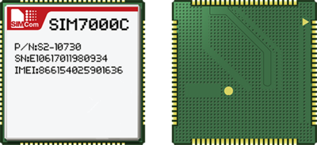
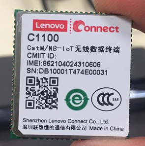
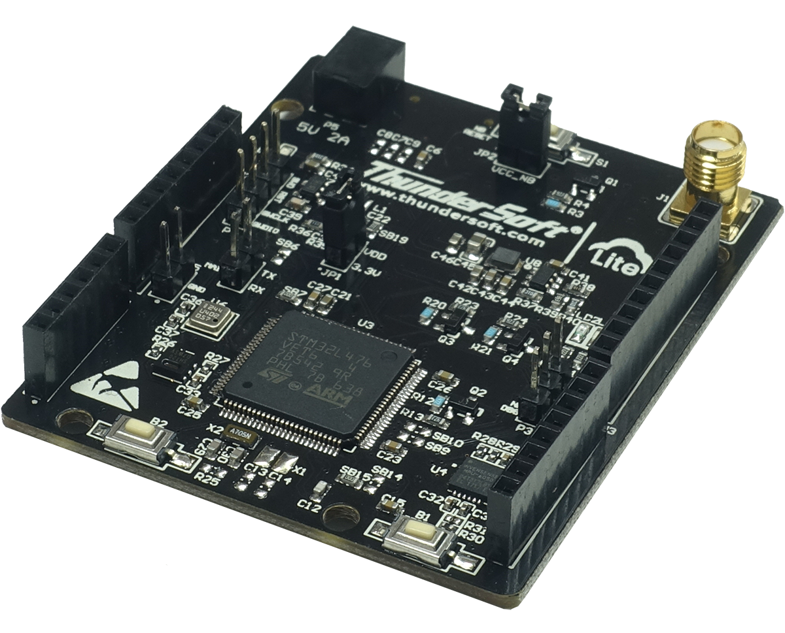
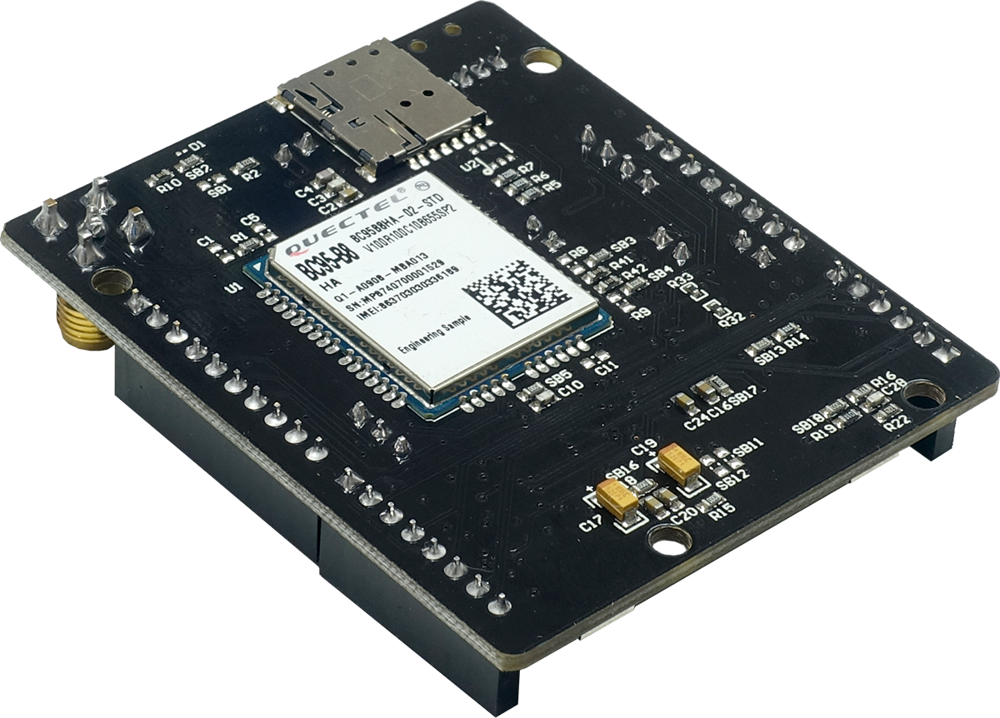
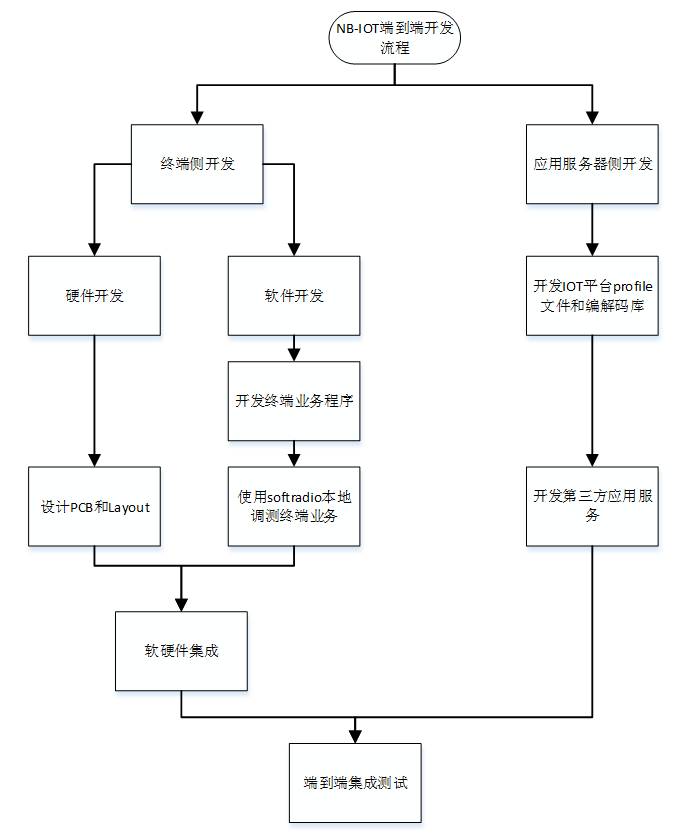
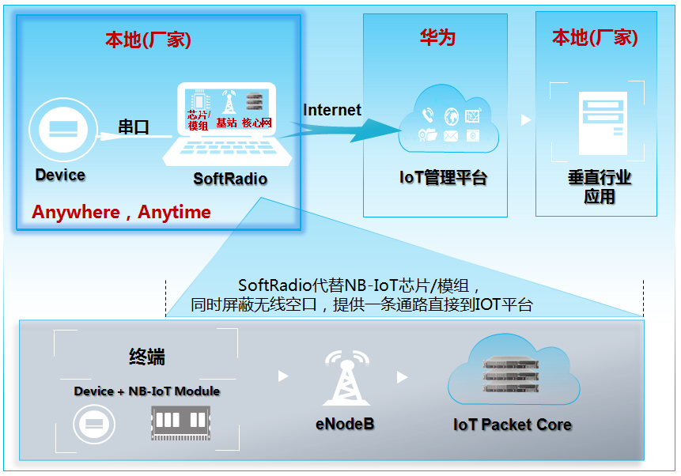
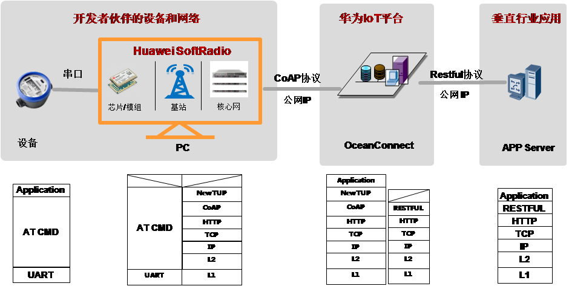

# NB-IoT学习笔记

## 概念
- NB-IoT：Narrow Band Internet of Things，即窄带物联网
- LPWAN：Low Power Wide Area Network，即低功耗广域网
- 北向：面向服务器端
- 南向：面向设备端
----

## 网络架构

- Device：NB-IoT终端（如智能水表、智能气表等）通过空口连接到eNodeB。    
- eNodeB：主要承担空口接入处理和小区管理等相关功能，通过S1-lite接口与IoT核心网进行连接，将非接入层数据转发给高层网元处理。
- IoT Core：承担与终端非接入层交互的功能，将IoT业务相关数据转发到IoT平台进行处理。
- IoT Platform：IoT联接管理平台汇聚从各种接入网得到的IoT数据，根据不同类型转发给相应的业务应用进行处理。
- APP Server：是IoT数据的最终汇聚点，根据客户的需求进行数据处理等操作。   

----

## NB-IoT主要应用
● 物联网设备    
涉及低功耗广域物联网的物联网设备主要是通过传感器和无线通信模块为用户提供实时的信息传输    
● 个人应用    
NB-IoT的超小芯片可以让穿戴产品做得更加小巧，其网络的深度覆盖则可以让小天线也可以取得良好的效果，此外满足定位和跟踪等更多应用场景的需求也是非常明确的。    
● 公共事业    
全球公共事业行业都已经启动或计划启动智能抄表、智能垃圾桶、智能环保、智慧停车等公用设施应用的改造工作。窄带物联网正在开启一个前所未有的广阔市场。     
● 工业应用    
窄带物联网技术应用于工业制造领域，将会带来工业制造转型升级。如今工厂逐渐开始将无线连接技术应用到产品或生产线中，以改进制造流程，而目前像WiFi这样的无线连接技术不够安全、可靠性不够高，NB-IoT为工业物联网无线连接提供了理想的解决方案。    

----

## 芯片（持续更新）
- 海思Hi2110
- 高通

----

## 模组（持续更新）
### LTE BC95 NB-IoT模组
海思芯片方案，BC95 是一款高性能、低功耗的NB-IoT 无线通信模块。其尺寸仅为19.9 × 23.6 × 2.2mm，能最大限度地满足终端设备对小尺寸模块产品的需求，同时有效地帮助客户减小产品尺寸并优化产品成本。BC95 在设计上兼容移远通信GSM/GPRS 系列的M95 模块，方便客户快速、灵活的进行产品设计和升级。 BC95 采用更易于焊接的LCC 封装，可通过标准SMT 设备实现模块的快速生产，为客户提供可靠的连接方式，特别适合自动化、大规模、低成本的现代化生产方式。SMT 贴片技术也使BC95 具有高可靠性，以满足复杂环境下的应用需求。    
    
其有如下分类：        
- B20：800MHz
- B5 : 850MHz（电信，韩国，南美）
- B8 : 900MHz（移动、联通，欧洲）

### SIM7000C
高通芯片方案    
     

### C1100
高通芯片方案    
     

## 开发板（持续更新）
### 	TurboX NB-IoT 开发板
            
中科创达LiteOS+NB-IoT开发板，此开发板借鉴了Arduino的设计，采用了低功耗的STM32L476的MCU，同时板载了三款常用的传感器，分别是：温湿度，压力和六轴。此款开发板的外观尺寸和Arduino Uno相似，因此市面上现有的大多数扣板可以直接拿来使用。    

----

## 开发概述
### 概述
- 对于合作伙伴而言，NB-IOT端到端的开发工作主要包括终端侧开发和应用服务器侧的开发。终端侧的开发主要包括包含模组的硬件PCB设计、终端业务代码开发以及网络接入调试；应用服务器侧的开发主要包括profile文件开发、编解码库开发以及调用IOT平台北向接口开发应用服务器。

- 端到端开发之前需要进行相关的准备，主要包括：NB-IOT模组获取、IOT平台资源和SoftRadio申请。

     - NB-IOT模组提供终端设备的通信功能，目前主要由移远和Ublox两个厂商提供。

     - IOT平台资源是NB-IOT端到端集成开发先决条件，开发者合作伙伴在集成开发之前，必须已经获取了华为IoT平台相关资源，并且在IoT平台上进行了APP应用创建以及基于IoT平台初步完成了APP 应用的开发。

- IOT平台资源申请步骤如下：

   1. 开发者首先申请加入IoT解决方案伙伴计划，加入方法请参考附件《》和《》，请仔细阅读《》。 MAR流程中合作方案审批通过后，你将收到MAR系统自动发出的知会邮件，收到后方可申请获取IoT平台资源。

   2. 华为IoT平台账号与密码申请，开发者合作伙伴将 “业务合作审批通过邮件”转发到 iotadmin@huawei.com 进行申请，邮件标题为“MAR伙伴申请IoT平台远程接入”，邮件内容附加企业名称，联系人及联系方式。

   3. 如何基于华为IoT平台进行应用开发以及想了解更多IoT平台信息，请参考http://developer.huawei.com/ict/cn/site-oceanconnect。

- SoftRadio是一款PC软件，合作伙伴在没有芯片/模组、NB-IOT基站和核心网的情况下，借助SoftRadio通过互联网连接到IOT平台和应用服务器，用于设备到应用服务器端到端的基本功能调试。详细介绍和申请请参考“”部分。

- 如下图是NB-IOT端到端集成开发流程。
     

### 应用服务器侧开发
- 应用服务器位于IOT平台北侧，为了确保应用服务器和IOT平台对接成功，应用服务器侧的开发内容主要包括：profile文件开发、编解码库开发和应用服务器开发。
#### Profile文件
- Profile是设备的抽象模型，把设备的功能抽象为服务。Profile定义了设备的服务类型和设备能力。
#### 编解码库
- 设备和IoT平台之间不统一应用层协议，为了能接入不同协议的设备，IoT平台支持调用设备提供的编解码插件包。编解码插件实现将设备上报的二进制码流转化成json格式，json的数据字段由profile文件的设备服务类型和设备能力决定。IoT平台根据profile文件中定义的制造商ID和设备model来决定一个编解码库。
#### 应用服务器开发
- 应用服务器用于保存NB-IOT终端发送的数据，以及发送下行数据给NB-IOT终端。在标准化的NB-IOT组网结构中，应用服务器连接在IOT平台的北向。IOT平台提供了支持http和https协议的北向接口，因此应用服务器与IOT平台的交互只需要调用相应的URL接口。
- IOT平台相关开发资料可参考：
http://developer.huawei.com/ict/cn/site-oceanconnect/resources    

### SoftRadio
- SoftRadio是一款PC软件，在测试场景下，合伙伙伴在不需要芯片/模组、NB-IoT基站和核心网的情况下，借助PC端的SoftRadio软件，任何时候都可通过互联网连接到IOT平台和APP应用，用于NB-IoT设备到APP Server端到端的基本功能调试，大大提升调试效率，加速Usecase业务快速上市。
     
- **NB-IoT Device/UE**：NB-IoT终端（如智能水表、智能气表等）通过空口连接到eNodeB。
- **SoftRadio**：在测试场景中模拟NB-IoT芯片与模组、屏蔽无线空口的软件。
- **eNodeB**：主要承担空口接入处理和小区管理等相关功能，通过S1-lite接口与IoT核心网进行连接，将非接入层数据转发给高层网元处理。
- **IoT核心网**：承担与终端非接入层交互的功能，将IoT业务相关数据转发到IoT平台进行处理。
- **IoT管理平台**：IoT联接管理平台（本文简称为IoT平台）汇聚从各种接入网得到的IoT数据，根据不同类型转发至相应的业务应用进行处理。当前，SoftRadio仅支持与华为IoT平台对接。
- **应用服务器**：是IoT数据的最终汇聚点，根据客户的需求进行数据处理等操作。

#### SoftRadio网络架构 
 
- **Device <---> SoftRadio**：Device和SoftRadio之间通过承载在UART串口线上的AT命令进行通信。物理上只需要将设备原来连接模组的针脚连接到PC机即可。SoftRadio支持的AT命令请参考用户指南。 
- **OceanConnect <---> Vertical Application**：二者之间通过Restful接口进行通信。

#### SoftRadio应用场景
- SoftRadio工具支持三大应用场景的远程化调试：终端MCU功能调试、应用服务器功能调试、E2E业务联调；
- SoftRadio主要应用于测试场景，不允许接入客户现网以及进行商业使用，开发者在无模组情况下，借助SoftRadio，进行端到端集成验证。在前期终端开发过程中，厂商只需要聚焦终端业务功能的开发，待基本功能在本地完成开发测试之后，再为终端设备集成好模组，申请到华为OpenLab实验室进行测试及验证。

- 备注：
    - SoftRadio目前仅能接入Huawei IoT Platform。
    - SoftRadio目前仅支持海思芯片 
    - 每台PC机只能接入一个Device设备，即每个SoftRadio软件每次只能接入一个Device设备

#### SoftRadio软件获取
- 用户可使用MAR账号或者开发者社区账号登陆华为开发者社区，直接下载SoftRadio工具（含用户指南）。
- 下载链接：
    - 中文链接：http://developer.huawei.com/ict/cn/rescenter/CMDA_FIELD_NB_IOT
    - 英文链接：http://developer.huawei.com/ict/en/rescenter/CMDA_FIELD_NB_IOT
- 将获取到的ESN按照《[license申请模板](http://developer.huawei.com/ict/rescenter/resource/download/eresource/171/28/SoftRadio-license%E7%94%B3%E8%AF%B7%E6%A8%A1%E6%9D%BF.xlsx)》反馈到邮箱softradio@huawei.com，来申请SoftRadio软件License。

### 与IOT平台的对接
#### 终端与IOT平台的对接
- 终端与IOT平台对接，首先需要设置设备ID和IOT平台地址；其次终端入网；然后发送数据到IOT平台。详细步骤如下所示：
   - 步骤1：终端上电，执行“AT+NRB”复位终端。如果返回OK，表示终端正常运行。
   - 步骤2：执行“AT+CFUN=0”关闭功能开关。如果执行成功，返回OK。 
   - 步骤3：执行“AT+NTSETID=1,设备ID”设置设备ID。设备ID为IMEI号，如果执行成功，返回OK。 
   - 步骤4：执行“AT+NCDP=IP,PORT”设置需要对接IOT平台的地址，端口为5683。如果执行成功，返回OK。 
   - 步骤5：执行“AT+CFUN=1”开启功能开关。如果执行成功，返回OK。 
   - 步骤6：执行“AT+NBAND=频段”设置频段。如果执行成功，返回OK。频段信息可以咨询模组厂商。 
   - 步骤7：执行“AT+CGDCONT=1,“IP”,“APN””设置核心网APN。如果执行成功，返回 OK，核心网APN可联系运营商（与运营商网络对接）或者OpenLab负责人（OpenLab网络对接）进行获取。
   - 步骤8：执行“AT+CGATT=1”进行入网。如果执行成功，返回OK。 
   - 步骤9：执行“AT+CGPADDR”查询终端是否获取到核心网分配的地址，如果获取到地址，表示终端入网成功。 
   - 步骤10：执行“AT+NNMI=1”设置下行数据通知功能，如果执行成功，返回OK。 
   - 步骤11：执行“AT+NMGS=数据长度，数据”发送上行数据，如果上行数据发送成功，返回OK。由于设置了 “AT+NNMI=1”，如果应用服务器发送了下行数据，上行数据发送成功后会自动携带下行数据。

#### 应用服务器相关操作
IOT平台提供北向接口，应用服务器调用这些北向接口实现：应用登录、消息订阅、设备注册、设置设备信息以及发送下行数据等功能。      
终端与应用服务器对接测试之前需要进行的操作如下：      
- **步骤1：应用登录**
   - 应用服务器访问IOT平台时必须首先进行登录，登录成功后获取访问令牌（accessToken）。

- **步骤2：消息订阅**
   - 为了能够接受设备上报的数据，应用服务器需要向IOT平台订阅通知消息。注：如果不需要IoT平台主动推送消息，可以省略此步骤。

- **步骤3：设备注册**
   - 所有设备必须先在北向进行注册，才允许连接到平台，通过注册设备，平台会为每个设备分配一个唯一的标识deviceId，后续应用服务器操作这个设备时通过deviceId来指定设备。

- **步骤4：设置设备信息**
   - 这一步是为了把设备的厂商、型号、设备类型等信息设置到平台。平台在处理过程中需要这些信息。   
    
基于IOT平台北向接口开发应用服务器相关资料可以参考开发者社区：   

http://developer.huawei.com/ict/cn/site-oceanconnect_doc

未完待续。。。

---

欢迎关注我的微信公众号：**墨意MOE**    

