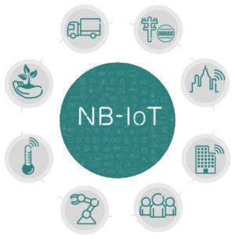

# NB-IoT学习笔记

## 概念
- NB-IoT：Narrow Band Internet of Things，即窄带物联网
- LPWAN：Low Power Wide Area Network，即低功耗广域网
     
## NB-IoT主要应用
● 物联网设备    
涉及低功耗广域物联网的物联网设备主要是通过传感器和无线通信模块为用户提供实时的信息传输    
● 个人应用    
NB-IoT的超小芯片可以让穿戴产品做得更加小巧，其网络的深度覆盖则可以让小天线也可以取得良好的效果，此外满足定位和跟踪等更多应用场景的需求也是非常明确的。    
● 公共事业    
全球公共事业行业都已经启动或计划启动智能抄表、智能垃圾桶、智能环保、智慧停车等公用设施应用的改造工作。窄带物联网正在开启一个前所未有的广阔市场。     
● 工业应用    
窄带物联网技术应用于工业制造领域，将会带来工业制造转型升级。如今工厂逐渐开始将无线连接技术应用到产品或生产线中，以改进制造流程，而目前像WiFi这样的无线连接技术不够安全、可靠性不够高，NB-IoT为工业物联网无线连接提供了理想的解决方案。    

## 模组（持续更新）
### LTE BC95 NB-IoT模组
BC95 是一款高性能、低功耗的NB-IoT 无线通信模块。其尺寸仅为19.9 × 23.6 × 2.2mm，能最大限度地满足终端设备对小尺寸模块产品的需求，同时有效地帮助客户减小产品尺寸并优化产品成本。BC95 在设计上兼容移远通信GSM/GPRS 系列的M95 模块，方便客户快速、灵活的进行产品设计和升级。 BC95 采用更易于焊接的LCC 封装，可通过标准SMT 设备实现模块的快速生产，为客户提供可靠的连接方式，特别适合自动化、大规模、低成本的现代化生产方式。SMT 贴片技术也使BC95 具有高可靠性，以满足复杂环境下的应用需求。    
    
其有如下分类：        
- B20：800MHz
- B5 : 850MHz（电信，韩国，南美）
- B8 : 900MHz（移动、联通，欧洲）

## 开发板（持续更新）
### 	TurboX NB-IoT 开发板
    
中科创达LiteOS+NB-IoT开发板，此开发板借鉴了Arduino的设计，采用了低功耗的STM32L476的MCU，同时板载了三款常用的传感器，分别是：温湿度，压力和六轴。此款开发板的外观尺寸和Arduino Uno相似，因此市面上现有的大多数扣板可以直接拿来使用。    

未完待续。。。

---

欢迎关注我的微信公众号：**墨意MOE**    

