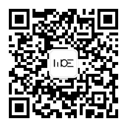

# Script On MCU / 脚本语言在MCU上的应用
## 概念
- MCU（Microcontroller Unit）：微控制器单元是以控制为主（而不是计算）的微型芯片
- 脚本语言：用于执行某种操作而预先编写的流程，一般需要操作系统平台支持。

## 背景
- 脚本语言是一种、易学习、使用便捷的编程语言，例如JavaScript、python都是非常适合编程入门的编程语言。广泛应用于前端，服务器，上位机应用等领域。但其需要操作系统支持，故在资源少，速率低，实时要求高的这类嵌入式应用中很少使用脚本语言编程。

## 问题：一个Python工程师离硬件有多远
- python工程师 ---> python应用程序 ---> python解释器 ---> 操作系统 ---> 底层驱动 ---> 硬件.   
- 上述环节中，操作系统其实是可以删除的,因为操作系统主要功能是资源分配，如果没有其他程序运行，只有Python在跑，那就不需要分配资源给其他不存在的程序。
- 如果没有的操作系统的支持，那硬件上直接跑解释器就可以了，同样没有了操作系统，一些底层驱动可以更简洁一些，这样Python程序员就离硬件控制更进一步，也更便于调试。 
 
## 原理
- 在MCU上直接建立Python解释器，python应用程序直接运行在硬件上。python的库函数通过更底层语言（c或汇编），python应用可以通过这些库函数直接操作硬件。
- 目前最主流的可以运行在MCU上的python解释器是[MicroPython](https://github.com/micropython/micropython)，已在多款硬件平台上完成移植。
- 而对于板级的驱动，可以在MicroPython中编写自己的库函数，从而连接Python应用程序和硬件。
- 对于多线程的支持，可能需要RT内核的支持。
- 依然分为交互模式和脚本模式，在交互模式下可以即刻编写并执行所输入的代码，而脚本模式则对已保存的文本文件进行逐行解析

未完待续。。。。    

---

欢迎关注我的微信公众号：**墨意MOE**    

