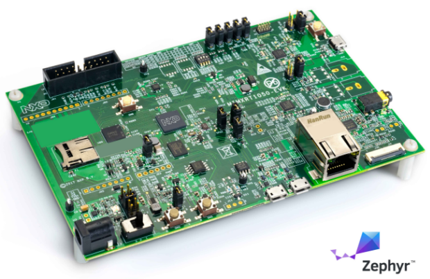
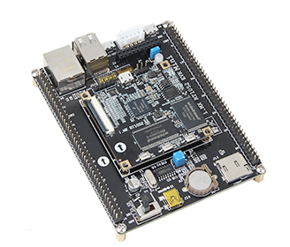

# i.MX RT 1020/1050/1060/1170
## 概述
i.MX RT1050是业界首款跨界处理器，兼具应用处理器的高性能与高度集成，以及微控制器的易用性和实时功能。i.MX RT1050基于Arm Cortex-M7内核，运行频率600 MHz。     

## 特点

   - 高性能Arm Cortex-M7
   - 3020 CoreMark/1284 DMIPS @ 600 MHz
   - 高达512 kB紧耦合存储器(TCM)
   - 实时低延迟相应，低至20 ns
   - 行业最低的动态功耗，带集成DC-DC转换器
   - 低功耗运行模式下运行频率为24MHz
   - 面向GUI和增强HMI的高级多媒体
       - 2D图形加速引擎
       - 并行摄像头传感器接口
       - LCD显示屏控制器(高达WXGA 1366x768)
       - 3x I2S，面向高性能多通道音频
   - 丰富的外部存储接口选项
       - NAND、eMMC、QuadSPI NOR Flash和Parallel NOR Flash
   - 无线连接接口：
       - Wi-Fi®、Bluetooth®、BLE、ZigBee®和Thread™

## 结构图

## 选型表

## 型号差异
条目  |  1020   |  1050   |   1060   |  1170   |   1200
-----|---------|----------|---------|---------|----------
SRAM |  256kB  |   512kB  |   1MB   |   2MB   |    2MB
封装  |  qfp    |  BGA     |  BGA    |  BGA   |     BGA
频率  |  500MHz |   600MHz |  600MHz |  600MHz |  800MHz

 
## 开发板     
- ShareBoard-i.MXRT1050：[ShareBoard](https://github.com/Share-Board/ShareBoard-iMXRT1050)     

- MIMXRT1050-EVK：[nxp官方开发板](https://www.nxp.com/products/processors-and-microcontrollers/applications-processors/i.mx-applications-processors/i.mx-rt-series/i.mx-rt1050-evaluation-kit:MIMXRT1050-EVK)     

- EasyARM-1052：[zlg开发板](http://www.zlgmcu.com/Category_2495/Index.aspx#id3)        

- MIMXRT1052开发板：[野火](https://item.taobao.com/item.htm?spm=a1z10.3-c.w4002-10310241583.17.68856b46etnS2A&id=565533049348)     

- MIMXRT1052开发板：[正点原子](https://item.taobao.com/item.htm?spm=a1z10.3-c-s.w4002-17232804691.33.33b6f03c7jWZU6&id=567308850594)     

