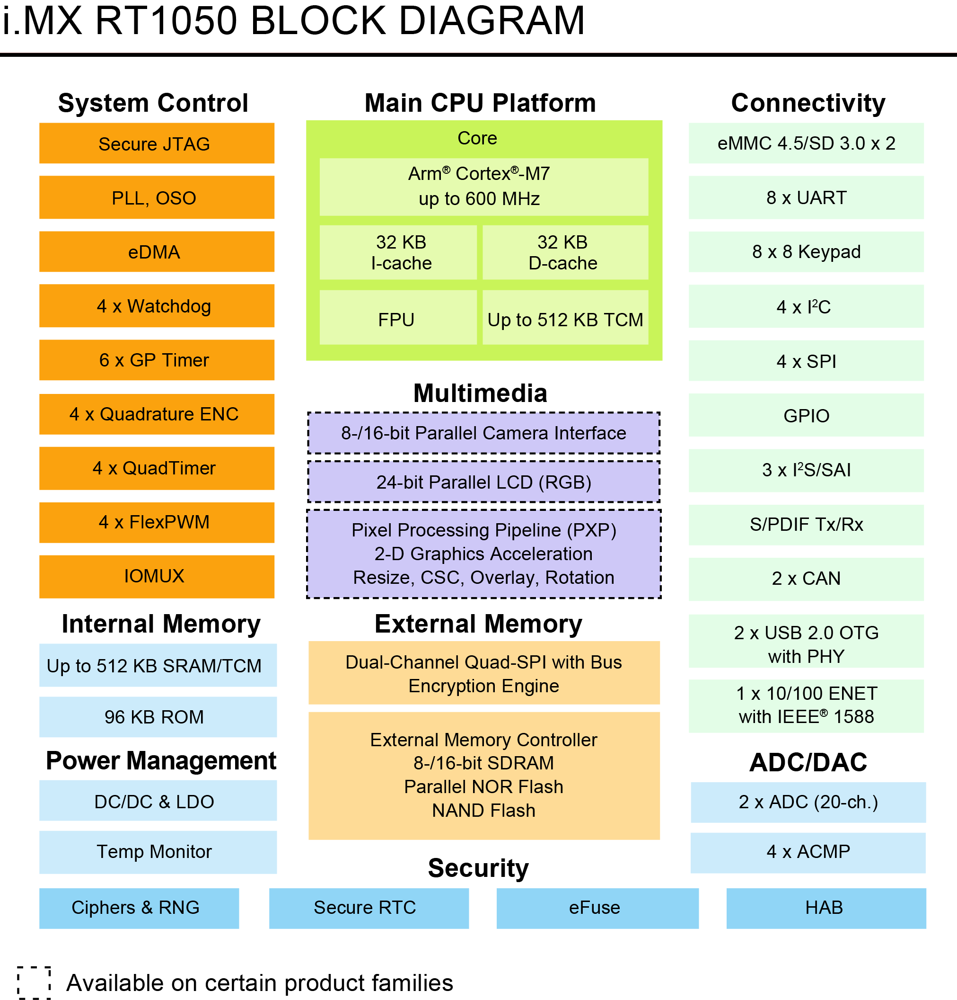
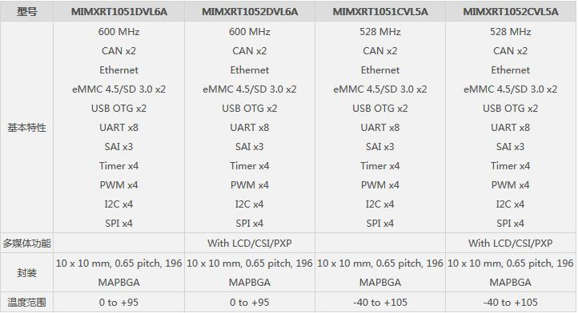

# i.MX RT 1050
## 概述
i.MX RT1050是业界首款跨界处理器，兼具应用处理器的高性能与高度集成，以及微控制器的易用性和实时功能。i.MX RT1050基于Arm® Cortex-M7®内核，运行频率600 MHz。     

## 特点

   - 高性能Arm Cortex-M7
   - 3020 CoreMark/1284 DMIPS @ 600 MHz
   - 高达512 kB紧耦合存储器(TCM)
   - 实时低延迟相应，低至20 ns
   - 行业最低的动态功耗，带集成DC-DC转换器
   - 低功耗运行模式下运行频率为24MHz
   - 面向GUI和增强HMI的高级多媒体
       - 2D图形加速引擎
       - 并行摄像头传感器接口
       - LCD显示屏控制器(高达WXGA 1366x768)
       - 3x I2S，面向高性能多通道音频
   - 丰富的外部存储接口选项
       - NAND、eMMC、QuadSPI NOR Flash和Parallel NOR Flash
   - 无线连接接口：
       - Wi-Fi®、Bluetooth®、BLE、ZigBee®和Thread™

## 结构图

## 选型表

 
## 开发板     

- MIMXRT1050-EVK：nxp官方开发板，配备SDRAM，hyper flash等。   
- EasyARM-1052：zlg开发板

